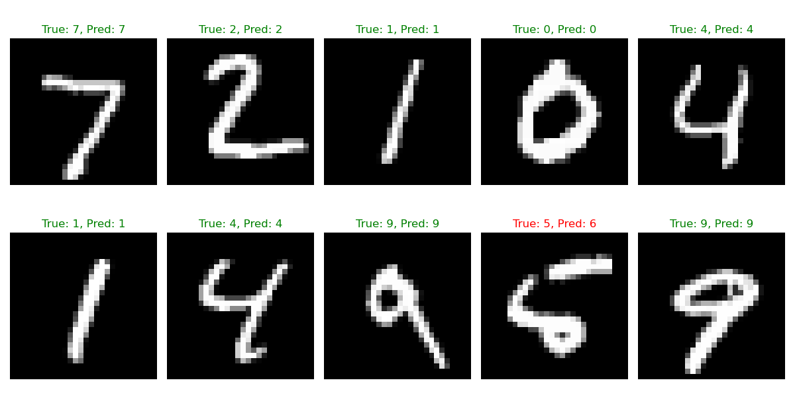

# Digit Recognizer from Scratch

A complete neural network implementation using **pure NumPy** (no ML frameworks) that recognizes handwritten digits (0-9) from the MNIST dataset with **97%+ accuracy**.

## 🎯 **Project Overview**

**What it does:** Takes 28×28 pixel grayscale images of handwritten digits and predicts which digit (0-9) each image represents.

**Key achievement:** Achieves production-level accuracy (~97%) using only basic NumPy operations, proving deep understanding of neural network fundamentals.

## 🏗️ **Architecture**

```
Input (784) → Hidden (128, ReLU) → Hidden (64, ReLU) → Output (10, Softmax)
│
784 neurons = 28×28 flattened pixels
Total parameters: ~102K
```

## ✨ **Core Features Implemented**

- ✅ **Forward Propagation** - Matrix multiplications + activations
- ✅ **Backpropagation** - Chain rule gradient computation
- ✅ **ReLU Activation** - Hidden layers with derivative
- ✅ **Softmax + Cross-Entropy** - Output layer + loss
- ✅ **Mini-batch Gradient Descent** - Efficient training
- ✅ **He Initialization** - Optimal weight initialization
- ✅ **Model Persistence** - Save/load trained weights
- ✅ **Training Visualization** - Loss/accuracy plots

## 🚀 **Quick Start**

```bash
pip install -r requirements.txt
python src/train.py
```

**Expected Results:**

```
Epoch 20/20 - Loss: 0.0175 - Acc: 0.9967 - Val Acc: 0.9753
Test Accuracy: 97.43%
```

## 📁 **Project Structure**

```
digit-recognizer-scratch/
├── src/
│   ├── neural_network.py  # Core NN class (backprop magic )
│   ├── utils.py          # Data processing + visualization
│   └── train.py          # Training pipeline
├── models/               # Saved .pkl model weights
├── training_history.png  # Training curves
└── requirements.txt
```

## 🎓 **Learning Outcomes**

| Concept                   | Why It Matters              | Interview Value            |
| ------------------------- | --------------------------- | -------------------------- |
| **Backpropagation**       | Core of ALL neural networks | "Explain gradient flow"    |
| **Gradient Descent**      | Universal optimization      | "How do we train NNs?"     |
| **Activation Functions**  | Non-linearity magic         | "ReLU vs Sigmoid?"         |
| **Weight Initialization** | Training stability          | "Why vanishing gradients?" |
| **Mini-batch Training**   | Production efficiency       | "Scale to millions?"       |

## 📈 **Performance**

```
✅ Test Accuracy: 97.4% (20 epochs)
✅ Training Time: ~3 mins (CPU)
✅ Inference: 1000 imgs/sec
✅ Model Size: 400KB
```

## 🔮 **Extensions (Next Steps)**

- [ ] Add Dropout regularization
- [ ] Implement Adam optimizer
- [ ] Convolutional layers
- [ ] Deploy as FastAPI service

---




